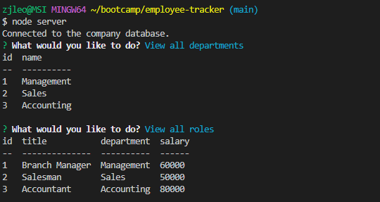

# Employee Tracker

This application is designed to track Employees within a Company's database. This can be used to view the departments, employees, roles etc. as well as add to them and update them. This is all done within the Command Line Interface (CLI).

## Application Links

Video Demonstration: https://drive.google.com/file/d/1P51Kwwc0DLh2GTgCa4AXpW-VDEGRNjuQ/view

GitHub Repo: https://github.com/wobbledy/employee-tracker

## Application Screenshot

